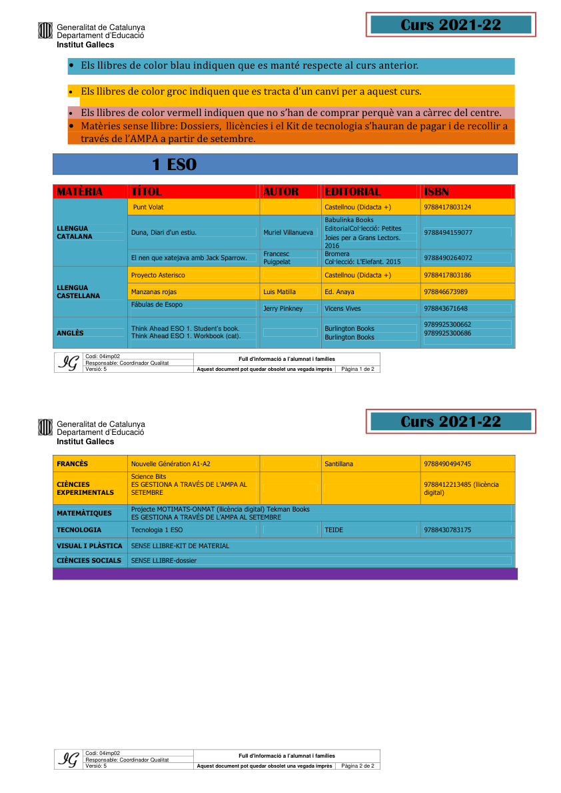

<p align="center">
    <a href="https://nuextract.ai/">
          
    </a>
</p>
<p align="center">
        🖥️ <a href="https://nuextract.ai/">API / Platform</a>&nbsp&nbsp | &nbsp&nbsp🤗 <a href="https://huggingface.co/numind">Hugging Face</a>&nbsp&nbsp |&nbsp&nbsp🗣️ <a href="https://discord.gg/3tsEtJNCDe">Discord</a>
</p>

---

# Reasoning comes to OCR  🧠✨📄🤘

**NuMarkdown-8B-Thinking** is the first reasoning OCR VLM. It is specifically trained to convert documents into clean Markdown files, well suited for RAG applications. It generates thinking tokens to figure out the layout of the document before generating the Markdown file.
It is particularly good at understanding documents with weird layouts and complex tables. The number of thinking tokens can vary from 20% to 500% of the final answer, depending on the task difficulty.

**NuMarkdown-8B-Thinking** is a fine-tune of **Qwen 2.5-VL-7B** on synthetic Doc &rarr; Reasoning &rarr; Markdown examples, followed by an RL phase (GRPO) with a layout-centric reward.

## Results

**NuMarkdown-8B-Thinking** is outperforming generic non-reasoning models like GPT-4o and specialized OCR models like OCRFlux. 
It is competitive against large reasoning closed-source models like Gemini 2.5.

### Arena ranking against popular alternatives (using trueskill-2 ranking system, with around 500 model-anonymized votes):
<p align="center">
  
| Rank | Model                                   | μ     | σ    | μ − 3σ |
| ---- | --------------------------------------- | ----- | ---- | ------ |
| 🥇 1 | **gemini-flash-reasoning**              | 26.75 | 0.80 | 24.35  |
| 🥈 2 | **NuMarkdown-reasoning**                | 26.10 | 0.79 | 23.72  |
| 🥉 3 | **NuMarkdown-reasoning-w/o\_grpo** | 25.32 | 0.80 | 22.93  |
| 4    | **OCRFlux-3B**                          | 24.63 | 0.80 | 22.22  |
| 5    | **gpt-4o**                              | 24.48 | 0.80 | 22.08  |
| 6    | **gemini-flash-w/o\_reasoning**         | 24.11 | 0.79 | 21.74  |
| 7    | **RolmoOCR**                            | 23.53 | 0.82 | 21.07  |

</p>

*We plan to realease a markdown arena, similar to llmArena, for complex document-to-markdown tasks to provide a tool to evaluate different solutions.*

### Win/Draw/Lose-rate against others models (image-only):
<p align="center">

</p>


## Training

1. **SFT**: Single epoch supervised fine-tuning on synthetic reasoning traces generated from public PDFs.  
2. **RL (GRPO)**: RL phase using a layout-centric reward with difficult image examples.

## Example:

<p align="center">

</p>

```
<think>
1. **Analyze the overall structure:** The document consists of two main sections, each containing a header, a set of bullet points, a title, a table, and a footer. The layout is consistent within each section but different between the two.

2. **Handle the first section header and bullet points:**
   - The top left corner has "Generalitat de Catalunya Departament d'Educació Institut Gal·lecs". This is a consistent header and should be transcribed as a level 3 heading.
   - The top right corner has "Curs 2021-22". This is a distinct header and should be transcribed as a level 3 heading.
   - Below the header, there are four bullet points. These are standard list items. I will use Markdown's unordered list syntax (`- `).

3. **Process the first section's main content - Table 1:**
   - **Identify table structure:** This is a complex table with a clear header row: "MATERIAL", "TÍTOL", "AUTOR", "EDITORIAL", "ISBN".
   - **Determine columns:** There are 5 columns.
   - **Handle merged cells:**
     - "Llengua Catalana" spans two rows.
     - "Llengua Castellana" spans three rows.
     - "Anglès" spans two rows.
   - **Populate table data:** Transcribe all text, including multi-line content within cells (e.g., "Babulinka Books\nEditorialCol·lecció: Pettes\nJoies per a Grans Lectors.\n2013").
   - **Markdown table creation:** Use standard Markdown table syntax, ensuring correct alignment and handling of multi-line content within cells.

4. **Handle the first section's footer:**
   - The footer contains "Codí: 04mp02", "Responsable: Coordinador Qualitat", "Versió: 5", "Full d'Informació a l'alumnat i famílies", "Aquest document pot quedar obsolet una vegada imprès", and "Pàgina 1 de 2". This is a simple text block at the bottom. I will transcribe it as a separate paragraph or list, maintaining the original layout if possible, but a simple paragraph is sufficient for a footer.

5. **Handle the second section header and bullet points:**
   - The top left corner has "Generalitat de Catalunya Departament d'Educació Institut Gal·lecs". This is a consistent header and should be transcribed as a level 3 heading.
   - The top right corner has "Curs 2021-22". This is a distinct header and should be transcribed as a level 3 heading.
   - Below the header, there are no bullet points, but there is a table.

6. **Process the second section's main content - Table 2:**
   - **Identify table structure:** This is a simpler table with a clear header row: "MATERIAL", "TÍTOL", "AUTOR", "EDITORIAL", "ISBN".
   - **Determine columns:** There are 5 columns.
   - **Populate table data:** Transcribe all text, including multi-line content within cells (e.g., "Projecte MOTIMATS-ONMAT (llicència digital) Tekman Books\nES GESTIONA A TRAVÉS DE L'AMPA AL SETEMBRE").
   - **Markdown table creation:** Use standard Markdown table syntax.

7. **Handle the second section's footer:**
   - The footer contains "Codí: 04mp02", "Responsable: Coordinador Qualitat", "Versió: 5", "Full d'Informació a l'alumnat i famílies", "Aquest document pot quedar obsolet una vegada imprès", and "Pàgina 2 de 2". This is a simple text block at the bottom. I will transcribe it as a separate paragraph or list, maintaining the original layout if possible, but a simple paragraph is sufficient for a footer.

8. **Final review:** Check for any missed text, incorrect formatting, or issues with table alignment. Ensure all original content is present and accurately represented in GitHub-Flavored Markdown. The image placeholders are not needed as there are no images in the document.
</think>
<answer>
### Generalitat de Catalunya
### Departament d'Educació
### Institut Gal·lecs

### Curs 2021-22

- Els llibres de color blau indiquen que es manté respecte al curs anterior.
- Els llibres de color groc indiquen que es tracta d'un canvi per a aquest curs.
- Els llibres de color vermell indiquen que no s'han de comprar perquè van a càrrec del centre.
- Matèries sense llibre: Dossiers, llicències i el Kit de tecnologia s'hauran de pagar i de recollir a través de l'AMPA a partir de setembre.

# 1 ESO

| MATERIAL | TÍTOL | AUTOR | EDITORIAL | ISBN |
|---|---|---|---|---|
| Llengua Catalana | Punt Volat | | Castellnou (Didacta +) | 9788417803124 |
| | Duna, Diari d'un estiu. | Muriel Villanueva | Babulinka Books<br>EditorialCol·lecció: Pettes<br>Joies per a Grans Lectors.<br>2013 | 9788494159077 |
| | El nen que xatejava amb Jack Sparrow. | Francesc Puigpelat | Bromera<br>Col·lecció: L'Elefant. 2015 | 9788490264072 |
| Llengua Castellana | Proyecto Asterisco | | Castellnou (Didacta +) | 9788417803186 |
| | Manzanas rojas | Luis Matilla | Ed. Anaya | 978846673989 |
| | Fàbulas de Esopo | Jerry Pinkney | Vicens Vives | 978843671648 |
| Anglès | Think Ahead ESO 1. Student's book.<br>Think Ahead ESO 1. Workbook (cat). | | Burlington Books<br>Burlington Books | 9788925300662<br>9789925300686 |

Codí: 04mp02
Responsable: Coordinador Qualitat
Versió: 5
Full d'Informació a l'alumnat i famílies
Aquest document pot quedar obsolet una vegada imprès
Pàgina 1 de 2

### Generalitat de Catalunya
### Departament d'Educació
### Institut Gal·lecs

### Curs 2021-22

| MATERIAL | TÍTOL | AUTOR | EDITORIAL | ISBN |
|---|---|---|---|---|
| FRANCÈS | Nouvelle Génération A1-A2 | | Santillana | 9788490494745 |
| CIÈNCIES EXPERIMENTALS | Science Bits<br>ES GESTIONA A TRAVÉS DE L'AMPA AL SETEMBRE | | | 9788412213485 (llicència digital) |
| MATEMÀTIQUES | Projecte MOTIMATS-ONMAT (llicència digital) Tekman Books<br>ES GESTIONA A TRAVÉS DE L'AMPA AL SETEMBRE | | | |
| TECNOLOGIA | Tecnologia 1 ESO | TEIDE | | 9788430783175 |
| VISUAL I PLÀSTICA | SENSE LLIBRE-KIT DE MATERIAL | | | |
| CIÈNCIES SOCIALS | SENSE LLIBRE-dossier | | | |

Codí: 04mp02
Responsable: Coordinador Qualitat
Versió: 5
Full d'Informació a l'alumnat i famílies
Aquest document pot quedar obsolet una vegada imprès
Pàgina 2 de 2
</answer>
```

## Quick start: 

## vLLM:
```
vllm serve numind/NuMarkdown-8B-Thinking --trust_remote_code --limit-mm-per-prompt image=1
```

```python
from openai import OpenAI
import base64

openai_api_key = "EMPTY"
openai_api_base = "http://localhost:8000/v1"

client = OpenAI(
    api_key=openai_api_key,
    base_url=openai_api_base,
)

def encode_image(image_path):
    """
    Encode the image file to base64 string
    """
    with open(image_path, "rb") as image_file:
        return base64.b64encode(image_file.read()).decode('utf-8')

base64_image = encode_image("image.png")
data_url = f"data:image/jpeg;base64,{base64_image}"

chat_response = client.chat.completions.create(
    model="numind/NuMarkdown-8B-Thinking",
    temperature=0.7,
    messages=[
        {
            "role": "user",
            "content": [
                {
                    "type": "image_url", 
                    "image_url": {"url": data_url},
                    "min_pixels": 100 * 28 * 28,
                    "max_pixels": 5000 * 28 * 28,
                },
            ],
        },
    ]
)

result = chat_response.choices[0].message.content
reasoning = result.split("<think>")[1].split("</think>")[0]
answer  = result.split("<answer>")[1].split("</answer>")[0]
print(answer)
```


## 🤗 Transformers:
```python
import torch
from PIL import Image
from transformers import AutoProcessor, Qwen2_5_VLForConditionalGeneration

model_id = "numind/NuMarkdown-8B-reasoning"       

processor = AutoProcessor.from_pretrained(
    model_id,
    trust_remote_code=True,
    min_pixels=100*28*28, max_pixels=5000*28*28   
)

model = Qwen2_5_VLForConditionalGeneration.from_pretrained(
    model_id,
    torch_dtype=torch.bfloat16,
    attn_implementation="flash_attention_2",
    device_map="auto",
    trust_remote_code=True,
)

img = Image.open("image.png").convert("RGB")
messages = [{
    "role": "user",
    "content": [
        {"type": "image"},
    ],
}]
prompt = processor.apply_chat_template(messages, tokenize=False, add_generation_prompt=True)
model_input = processor(text=prompt, images=[img], return_tensors="pt").to(model.device)

with torch.no_grad():
    model_output = model.generate(**model_input, temperature = 0.7, max_new_tokens=5000)

result = processor.decode(model_output[0])
reasoning = result.split("<think>")[1].split("</think>")[0]
answer  = result.split("<answer>")[1].split("</answer>")[0]
print(answer)
```
